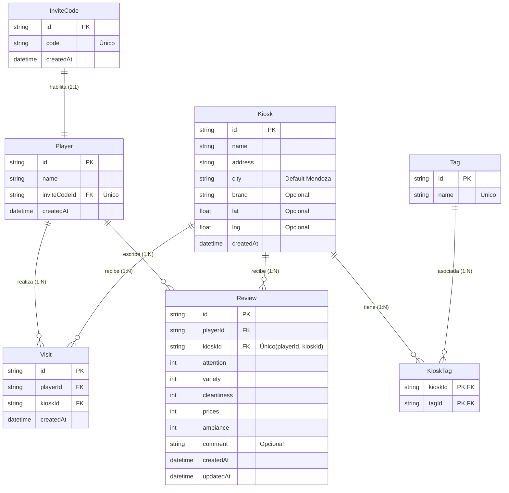

# Modelo de datos

> Implementado con **Prisma** sobre PostgreSQL. Schema en
> [`src/apps/api/prisma/schema.prisma`](../src/apps/api/prisma/schema.prisma).
> Este MVP cubre el subconjunto del dominio necesario para el lado **player**.

## Entidades

### InviteCode
Código que habilita el alta de un player (acceso por invitación).

| Campo | Tipo | Notas |
|---|---|---|
| id | String (cuid) | PK |
| code | String | único |
| createdAt | DateTime | |

### Player
Cliente recurrente de kioscos. Se da de alta canjeando un `InviteCode`.

| Campo | Tipo | Notas |
|---|---|---|
| id | String (cuid) | PK |
| name | String | |
| inviteCodeId | String | FK → InviteCode (único: 1 código ↔ 1 player) |
| createdAt | DateTime | |

### Kiosk
Local. Agnóstico de marca (`brand` opcional).

| Campo | Tipo | Notas |
|---|---|---|
| id | String (cuid) | PK |
| name | String | |
| address | String | |
| city | String | default "Mendoza" |
| brand | String? | "Yes", null si es independiente |
| lat, lng | Float? | ubicación |

### Tag
Etiqueta de kiosco (24hs, Panchos, Carga SUBE, etc.). Relación M:N con Kiosk vía `KioskTag`.

### Visit
Visita de un player a un kiosco. Base del futuro motor de promos (frecuencia).

| Campo | Tipo | Notas |
|---|---|---|
| id | String (cuid) | PK |
| playerId | String | FK → Player |
| kioskId | String | FK → Kiosk |
| createdAt | DateTime | |

### Review
Reseña con puntaje por categorías (1-5). **Una por player por kiosco** (editable).

| Campo | Tipo | Notas |
|---|---|---|
| id | String (cuid) | PK |
| playerId | String | FK → Player |
| kioskId | String | FK → Kiosk |
| attention | Int | atención (1-5) |
| variety | Int | variedad (1-5) |
| cleanliness | Int | limpieza (1-5) |
| prices | Int | precios (1-5) |
| ambiance | Int | ambiente (1-5) |
| comment | String? | opcional |
| createdAt / updatedAt | DateTime | |

Restricción: `@@unique([playerId, kioskId])`.

## Relaciones

- Un **InviteCode** habilita exactamente un **Player** (1:1).
- Un **Player** tiene muchas **Visit** y muchas **Review**.
- Un **Kiosk** acumula muchas **Visit** y **Review**, y tiene muchos **Tag** (M:N).
- Una **Review** pertenece a un Player y un Kiosk; es única por ese par.

## Fuera de alcance del MVP (modelado para etapas futuras)

`Owner`, `Admin`, `Promotion`, `PromotionRule`, `Redemption` — el lado B2B y el
motor de promociones por reglas. Ver el diagrama de clases completo en
[`diagrama-clases.svg`](./diagrama-clases.svg).
