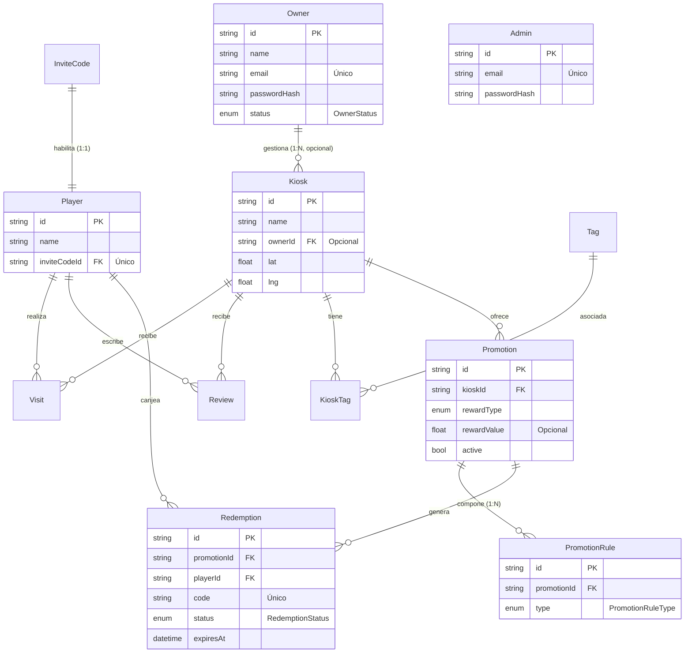

# Modelo de datos

> Implementado con **Prisma** sobre PostgreSQL. Schema en
> [`src/apps/api/prisma/schema.prisma`](../src/apps/api/prisma/schema.prisma).
> Cubre el **modelo de dominio completo (11 clases)** del TP2: usuarios y acceso,
> catálogo, actividad del player y el motor de promociones.

## Mapeo de la herencia (User → Player / Owner / Admin)

El diagrama de clases define `User` como **clase abstracta** con tres subclases
concretas. Prisma no soporta herencia nativa; se eligió el mapeo
**table-per-concrete-class**: `User` no tiene tabla propia y sus atributos se
"empujan" a cada subclase. El discriminador de rol viaja en el JWT (enum `Role`).

Motivo de la decisión:
- **Evita nullables**: un `Player` se autentica por invite code (sin email/password),
  un `Owner`/`Admin` por email+password. Cada tabla guarda solo lo que le aplica.
- **No rompe el flujo del player** ya implementado (la tabla `Player` queda intacta).
- Es un mapeo OO→relacional estándar y suficiente para el alcance del TP.

## Enums

| Enum | Valores |
|---|---|
| `Role` | PLAYER · OWNER · ADMIN |
| `OwnerStatus` | PENDIENTE_VALIDACION · VALIDADO · RECHAZADO |
| `PromotionRuleType` | FREQUENCY · AMOUNT · PRODUCTS |
| `RewardType` | FREE_PRODUCT · DISCOUNT_PCT · DISCOUNT_AMOUNT · TWO_FOR_ONE |
| `RedemptionStatus` | PENDING · REDEEMED · EXPIRED |

## Entidades

### Usuarios y acceso

**InviteCode** — código que habilita el alta de un player (acceso por invitación).
`id` (cuid, PK) · `code` (único) · `createdAt`.

**Player** — cliente recurrente. Subclase de User (auth por invite code).
`id` (PK) · `name` · `inviteCodeId` (FK → InviteCode, único 1:1) · `createdAt`.

**Owner** — dueño de uno o más kioscos. Subclase de User (auth email+password).
`id` (PK) · `name` · `email` (único) · `passwordHash` · `status` (OwnerStatus,
default PENDIENTE_VALIDACION) · `createdAt`.

**Admin** — administrador de la plataforma. Subclase de User (auth email+password).
`id` (PK) · `name` · `email` (único) · `passwordHash` · `createdAt`.

### Catálogo

**Kiosk** — local, agnóstico de marca. `id` (PK) · `name` · `address` · `city`
(default "Mendoza") · `brand?` · `lat?` · `lng?` · `ownerId?` (FK → Owner,
opcional: un kiosco puede estar pre-cargado y luego ser reclamado) · `createdAt`.

**Tag** — etiqueta (24hs, Panchos, etc.). M:N con Kiosk vía **KioskTag**.

### Actividad del player

**Visit** — visita de un player a un kiosco (insumo del motor, frecuencia).
`id` · `playerId` (FK) · `kioskId` (FK) · `createdAt`.

**Review** — reseña con puntaje por 5 categorías (1-5). **Una por player por
kiosco** (editable, `@@unique([playerId, kioskId])`). `attention` · `variety` ·
`cleanliness` · `prices` · `ambiance` · `comment?` · `createdAt`/`updatedAt`.

### Motor de promociones

**Promotion** — promo de un kiosco. `id` · `kioskId` (FK) · `title` ·
`description?` · `active` · recompensa (`rewardType`, `rewardValue?`,
`rewardProduct?`) · audiencia opcional (`audienceDays[]`, `audienceFromHour?`,
`audienceToHour?`) · caps (`capPerPlayer?`, `capPerPeriod?`, `capTotal?`,
`periodDays?`) · vigencia (`startsAt?`, `endsAt?`).

**PromotionRule** — regla del motor (composición con Promotion; se combinan con
AND). `id` · `promotionId` (FK) · `type` (PromotionRuleType) · params según tipo:
`windowDays?`, `minVisits?` (FREQUENCY), `minAmount?` (AMOUNT), `products[]`
(PRODUCTS).

**Redemption** — canje gatillado para un player. `id` · `promotionId` (FK) ·
`playerId` (FK) · `code` (único, 6 chars) · `status` (RedemptionStatus) ·
`expiresAt` · `redeemedAt?` · `createdAt`.

## Relaciones

- Un **Owner** gestiona 0..N **Kiosk** (1 owner → N kioscos; un kiosco puede no
  tener owner aún).
- Una **Promotion** se compone de 1..N **PromotionRule** (AND) y genera **Redemption**.
- Una **Redemption** vincula una Promotion con el Player que la canjea.

> El diagrama de clases UML completo está en
> [`diagrama-clases.svg`](./diagrama-clases.svg).
