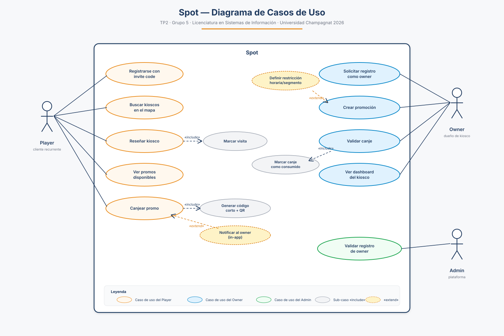
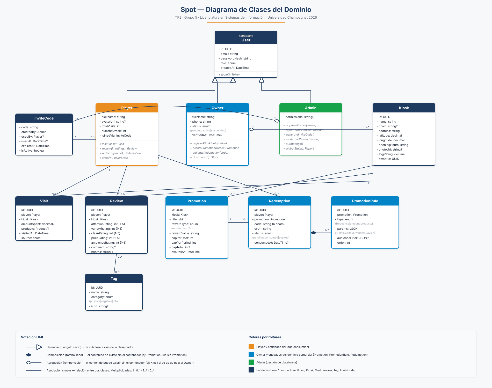

# TP N° 2 — Setup Técnico

**Materia:** Laboratorio de Desarrollo de Software
**Carrera:** Licenciatura en Sistemas de Información
**Universidad:** Universidad Champagnat · 2026
**Grupo:** N° 5
**Integrantes:**
- Gregorio Luján (@lujangrego99)
- Bautista Navarro (@BautiNavarro)
- Matías Aguiar (@matiasaguiar-dotcom)
- Joel Aisama (@aisamajoel-tech)

**Proyecto:** Spot

---

## Índice

1. Repositorio GitHub
2. Estrategia de ramas
3. Entorno de desarrollo configurado
4. Diagrama de casos de uso
5. Diagrama de clases del dominio
6. Justificación del stack tecnológico

---

## 1. Repositorio GitHub

**URL:** https://github.com/UCH-LDS-2026/grupo-05 (privado, alojado en la organización `UCH-LDS-2026` del curso).

### 1.1 Estructura del repositorio

```
grupo-05/
├── docs/                          Documentación viva del proyecto
│   ├── arquitectura.md
│   ├── modelo-datos.md
│   ├── product-discovery.md
│   ├── estrategia-ramas.md
│   ├── casos-de-uso.svg
│   └── diagrama-clases.svg
├── src/                           Código fuente (a partir de TP3)
├── tests/                         Tests (a partir de TP4)
├── trabajos-practicos/            Entregables por TP
│   ├── tp1/  → Definición del proyecto
│   └── tp2/  → Setup técnico (este TP)
├── .gitignore
└── README.md
```

### 1.2 `.gitignore`

El `.gitignore` contempla las particularidades del stack: Node/pnpm, builds de Expo y Next.js, Prisma client generado, archivos nativos de Android/iOS, variables de entorno (`.env`), coverage de tests, archivos de IDE y de sistema operativo. Conserva los `.env.example` para que cada integrante sepa qué variables hay que setear.

### 1.3 Protección de la rama `main`

Configurada en **Settings → Branches → Branch protection rules** del repositorio para `main`:

- ✓ Require a pull request before merging
- ✓ Require approvals: **1**
- ✓ Dismiss stale pull request approvals when new commits are pushed
- ✓ Require status checks to pass before merging (placeholder hasta que exista CI en TP4)
- ✓ Require branches to be up to date before merging
- ✓ Do not allow bypassing the above settings (incluye administradores)
- ✗ No se permite force push
- ✗ No se permite borrar `main`

---

## 2. Estrategia de ramas

El equipo adopta **GitHub Flow simple** por ser el modelo más práctico para un grupo chico (4 integrantes) que entrega de manera incremental sobre un único entorno. Se descarta GitFlow clásico porque introduce overhead de mantener `develop` además de `main` sin aportar valor en este proyecto.

### 2.1 Modelo

```
main (protegida, siempre estable)
  ├── feature/onboarding-owner       (Matías)
  ├── feature/motor-promociones      (Bauti)
  ├── feature/canje-qr               (Joel)
  └── fix/auth-invite-code           (Grego)
```

- `main` jamás recibe commits directos. Siempre representa código que compila.
- Cada **feature** o **fix** se desarrolla en una rama propia que arranca desde `main`.
- Al terminar se abre un **Pull Request** contra `main`, con al menos **1 review** de otro integrante.
- Mergeo con **squash** para mantener el historial limpio.
- La rama de feature se borra después del merge.

### 2.2 Convenciones

**Nombres de rama:**

| Prefijo | Uso | Ejemplo |
|---|---|---|
| `feature/` | Nueva funcionalidad | `feature/leaderboard-grupal` |
| `fix/` | Bug fix | `fix/error-canje-expirado` |
| `docs/` | Solo documentación | `docs/diagramas-tp3` |
| `chore/` | Tooling, deps, CI | `chore/upgrade-prisma` |
| `refactor/` | Refactor sin cambio funcional | `refactor/promo-engine` |

**Mensajes de commit** (Conventional Commits):

```
feat(promos): agregar regla de monto acumulado
fix(auth): validar formato de invite code antes de query
docs(tp2): sumar diagrama de clases
chore(deps): bump Expo SDK a 52
```

### 2.3 Flujo típico

```bash
git checkout main && git pull origin main
git checkout -b feature/mi-feature
# trabajar, commitear
git push -u origin feature/mi-feature
# abrir PR en github.com/UCH-LDS-2026/grupo-05
# review + merge (squash)
git checkout main && git pull origin main
git branch -d feature/mi-feature
```

Documento completo en [`docs/estrategia-ramas.md`](../../docs/estrategia-ramas.md).

---

## 3. Entorno de desarrollo configurado

### 3.1 Versiones de SDK requeridas

| Tool | Versión mínima | Verificar con |
|---|---|---|
| Node.js | 20.x LTS | `node -v` |
| pnpm | 9.x | `pnpm -v` |
| Git | 2.40+ | `git --version` |
| PostgreSQL | 16.x (local o Docker) | `psql --version` |
| Docker + Docker Compose | 24+ / v2 | `docker --version` |
| Expo CLI | última estable | `npx expo --version` |

### 3.2 Pasos de instalación

```bash
# 1. Clonar el repo
git clone https://github.com/UCH-LDS-2026/grupo-05.git
cd grupo-05

# 2. Instalar dependencias (cuando exista código en TP3+)
pnpm install

# 3. Variables de entorno
cp .env.example .env

# 4. Levantar la base de datos local (Docker)
docker compose up -d db

# 5. Aplicar migraciones (cuando exista schema)
pnpm prisma migrate dev

# 6. Arrancar
pnpm --filter api dev      # backend (puerto 3001)
pnpm --filter app start    # mobile Expo
pnpm --filter owner dev    # panel web (puerto 3000)
```

### 3.3 Validación por integrante

Cada integrante validó la instalación local del entorno y adjuntó captura.

| Integrante | Sistema operativo | Estado | Captura |
|---|---|---|---|
| Gregorio Luján | Windows 11 + WSL2 Ubuntu 22.04 | OK | `entorno-instalado/grego.png` |
| Bautista Navarro | _completar_ | pendiente | `entorno-instalado/bauti.png` |
| Matías Aguiar | _completar_ | pendiente | `entorno-instalado/matias.png` |
| Joel Aisama | _completar_ | pendiente | `entorno-instalado/joel.png` |

> Las capturas viven en [`trabajos-practicos/tp2/entorno-instalado/`](entorno-instalado/) y muestran la salida de `node -v && pnpm -v && git --version && psql --version` en cada equipo.

---

## 4. Diagrama de casos de uso



Fuente vectorial: [`docs/casos-de-uso.svg`](../../docs/casos-de-uso.svg).

**Actores identificados:** 3
- **Player** — cliente recurrente, usa la app móvil
- **Owner** — dueño/encargado de kiosco, usa el panel web
- **Admin** — equipo de plataforma, gestiona altas y moderación

**Casos de uso principales:** 10 (5 del player, 4 del owner, 1 del admin)

| # | Caso de uso | Actor | Descripción corta |
|---|---|---|---|
| 1 | Registrarse con invite code | Player | Crea cuenta usando un código distribuido por un admin u otro player |
| 2 | Buscar kioscos en el mapa | Player | Visualiza kioscos cercanos diferenciando visitados de no visitados |
| 3 | Reseñar kiosco | Player | Puntúa 5 categorías + tags + fotos |
| 4 | Ver promos disponibles | Player | Lista promociones para las que el player ya califica |
| 5 | Canjear promo | Player | Genera código corto + QR para presentar en el local |
| 6 | Solicitar registro como owner | Owner | Carga datos personales y del kiosco para validación |
| 7 | Crear promoción | Owner | Define reglas combinadas (frecuencia + monto + productos), recompensa y límites |
| 8 | Validar canje | Owner | Escanea QR o ingresa código del cliente en el mostrador |
| 9 | Ver dashboard del kiosco | Owner | Métricas: clientes únicos, visitas, canjes, rating |
| 10 | Validar registro de owner | Admin | Aprueba o rechaza solicitudes de owners pendientes |

**Relaciones `«include»` y `«extend»`:**

| Caso | Tipo | Sub-caso | Motivo |
|---|---|---|---|
| Reseñar kiosco | `«include»` | Marcar visita | Toda reseña genera automáticamente una visita |
| Canjear promo | `«include»` | Generar código corto + QR | Necesario para el flujo de canje |
| Validar canje | `«include»` | Marcar canje como consumido | Cierra el ciclo del canje |
| Crear promoción | `«extend»` | Definir restricción horaria/segmento | Opcional, solo si el owner lo configura |
| Canjear promo | `«extend»` | Notificar al owner (in-app) | Opcional según preferencias del owner |

---

## 5. Diagrama de clases del dominio



Fuente vectorial: [`docs/diagrama-clases.svg`](../../docs/diagrama-clases.svg).

**11 clases del dominio**, agrupadas por área:

| Área | Clases |
|---|---|
| Usuarios y acceso | `User` (abstract), `Player`, `Owner`, `Admin`, `InviteCode` |
| Catálogo | `Kiosk`, `Tag` |
| Actividad del player | `Visit`, `Review` |
| Motor de promociones | `Promotion`, `PromotionRule`, `Redemption` |

**Relaciones principales:**

| Origen | Destino | Tipo | Multiplicidad | Comentario |
|---|---|---|---|---|
| Player → User | Herencia | — | Player es un User |
| Owner → User | Herencia | — | Owner es un User |
| Admin → User | Herencia | — | Admin es un User |
| Owner → Kiosk | Agregación | 1 — 1..* | Un owner gestiona uno o más kioscos |
| Player → Visit | Asociación | 1 — 0..* | Un player puede tener muchas visitas |
| Kiosk → Visit | Asociación | 1 — 0..* | Un kiosco recibe muchas visitas |
| Player → Review | Asociación | 1 — 0..* | Un player escribe muchas reseñas |
| Kiosk → Review | Asociación | 1 — 0..* | Un kiosco recibe muchas reseñas |
| Review ↔ Tag | Asociación N:N | 0..* — 0..* | Cada reseña tiene varios tags |
| Kiosk → Promotion | Asociación | 1 — 0..* | Un kiosco define varias promociones |
| Promotion → PromotionRule | Composición | 1 — 1..* | Las reglas no existen sin la promoción |
| Promotion → Redemption | Asociación | 1 — 0..* | Cada promo genera múltiples canjes |
| Player → Redemption | Asociación | 1 — 0..* | Un player canjea varias promos |

### 5.1 Decisiones de modelado

- **Herencia simple para roles** (User abstracto + Player/Owner/Admin) en vez de un único `User` con campo `role` enum: permite atributos y métodos específicos por rol sin nullables (ej: `currentStreak` solo aplica a Player, `verifiedAt` solo a Owner).
- **`PromotionRule` como entidad separada** en lugar de un JSON dentro de `Promotion`: permite que el motor de evaluación itere sobre reglas tipadas y permite combinaciones futuras sin migrar el schema.
- **Composición** entre `Promotion` y `PromotionRule` (no agregación): si se borra la promo, las reglas no tienen sentido independiente.
- **Multiplicidad 1..* entre Owner y Kiosk** para soportar el caso (frecuente) en que un dueño tiene varias sucursales.

---

## 6. Justificación del stack tecnológico

### 6.1 Frontend mobile (player) — Expo (React Native) + React Native Web

El player consume la app principalmente desde el celular: marca visitas, escanea QR, ve el mapa de kioscos. Necesitamos despliegue rápido en iOS y Android con un solo codebase. **Expo** resuelve esto con un toolchain unificado, OTA updates y módulos nativos para mapas, cámara (canje QR) y geolocalización. Sumar **React Native Web** nos da una versión web complementaria del lado player sin escribir nada extra, útil para los integrantes durante desarrollo y para la demo.

Alternativas descartadas:
- **Flutter**: requeriría aprender Dart y el equipo ya tiene experiencia en React/TS.
- **Nativo puro (Swift/Kotlin)**: doble codebase no justificable para un MVP de 5-10 personas.

### 6.2 Frontend web (owner / admin) — Next.js (React)

El panel del owner es densamente informacional (dashboards con KPIs, formularios complejos del motor de promociones, listados de canjes). Aquí el formato móvil-first de Expo no es óptimo: necesitamos layout web responsive, SEO eventual de páginas públicas y server-side rendering para las vistas con datos sensibles. **Next.js** es el estándar de facto para apps web con React y se integra naturalmente con el resto del stack TypeScript.

### 6.3 Backend — NestJS (TypeScript)

NestJS es opinionado, modular y trae soporte nativo para inyección de dependencias, validación, guards, interceptors y testing. Para un proyecto con varios módulos diferenciados (auth, kiosks, reviews, promotions, redemptions, admin) la estructura modular de NestJS facilita asignar features a distintos integrantes sin pisarse. El motor de promociones encaja como un servicio dedicado con sus propios casos de prueba.

Alternativas descartadas:
- **Express puro**: sin estructura impuesta, escalaría mal con 4 personas.
- **Django/Rails**: lenguajes distintos al frontend; perderíamos el tipado compartido y la posibilidad de mover schemas/DTOs entre capas.

### 6.4 Base de datos — PostgreSQL + Prisma ORM

El dominio de Spot es **fuertemente relacional**: kioscos, visitas, reseñas, promociones, canjes y reglas tienen integridad referencial estricta (un canje siempre apunta a una promo válida, una reseña a un kiosco existente, etc.). Una base relacional con FK reales y constraints de check es lo correcto. **PostgreSQL** suma soporte robusto de JSONB (para los `params` de `PromotionRule`), índices geoespaciales (PostGIS si hace falta para el mapa) y tipos enum nativos.

**Prisma** se elige sobre TypeORM porque su schema declarativo único genera tipos TypeScript automáticamente para el cliente, lo que reduce errores y duplicación entre capas. Las migraciones versionadas vivenen `prisma/migrations/` y forman parte del repo.

Alternativas descartadas:
- **MongoDB**: las relaciones críticas del dominio harían que terminemos haciendo joins manuales en aplicación, perdiendo las garantías que da el motor relacional.
- **TypeORM**: API menos ergonómica, generación de tipos menos confiable.

### 6.5 Decisiones cross

- **Lenguaje único TypeScript** en frontend, backend y scripts: reduce el costo cognitivo de cambio de contexto y permite compartir tipos (`shared/types/`) entre capas.
- **Almacenamiento de archivos en Cloudflare R2** (no S3): mismo protocolo S3 pero sin egress charges, que es importante porque las reseñas pueden incluir varias fotos por visita.
- **Auth dual** — JWT + invite codes para players (mantiene el círculo cerrado del MVP) y registro abierto + validación manual para owners (no aplica OAuth porque los owners no necesariamente tienen Google/Apple ID corporativo).
- **Deploy con Docker + Easypanel** sobre un VPS: stack reproducible y económico, sin lock-in con un cloud provider y simple para auto-deploy desde `main`.
